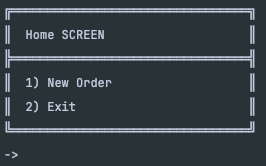
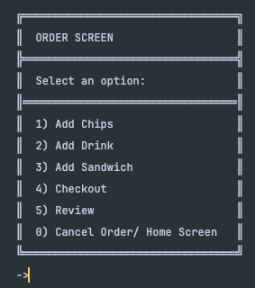
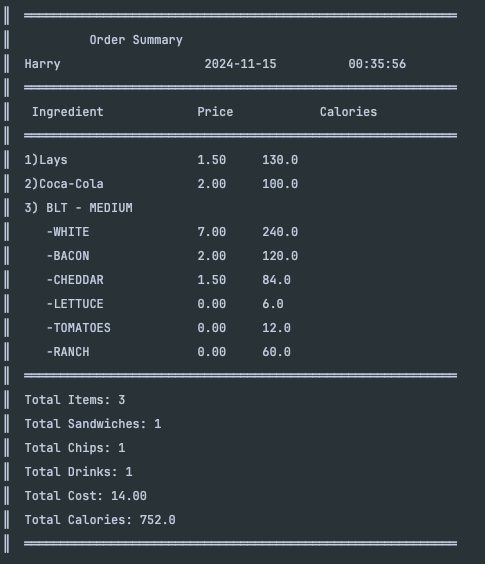
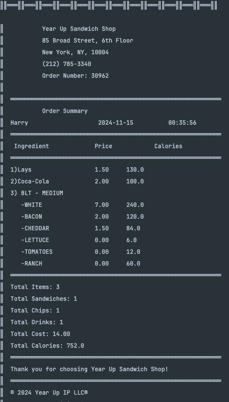

<div style="align-content: center">
  <h1>Sandwich Shop Ordering System</h1>
</div>

<div style="align-content: center">
  <h2>Capstone Two Project</h2>
</div>

<div style="align-content: center">
  <h3>Description</h3>
</div>

The **Sandwich Shop Ordering System** is a Java-based application designed to help users customize, order, and track
their sandwich purchases in a simple and intuitive manner. This project uses object-oriented principles and design
patterns to handle different sandwich components like bread, meat, cheese, vegetables, sauces, and beverages. The system
allows customers to easily create custom sandwiches or select from preset options, add side items like chips and drinks,
and process orders with detailed receipts.

<div style="align-content: center">
  <h3>Features:</h3>
</div>

- **Sandwich Customization:** Users can choose from various types of bread, meats, cheeses, vegetables, and sauces to
  create a personalized sandwich.
- **Preset Sandwiches:** Users can also select preset sandwich combinations from the menu.
- **Order Processing:** The application calculates the total cost and calories of the order.
- **Receipt Generation:** After checkout, a detailed receipt is generated and saved as a JSON file.
- **User-Friendly Interface:** A console-based UI that interacts with users, displaying relevant information and guiding
  them through the ordering process.


<div style="align-content: center">
  <h3>Design Patterns Implementation</h3>
  <p>Singleton</p>
  <p>Command Pattern</p>  
  <p>Builder Pattern</p>
</div>

<div style="align-content: center">
  <h3>Screenshots</h3>
</div>
<div style="align-content: center">
  <h4>Main Menu</h4>
    <h5>Home Screen</h5>
      <div></div>
    <h5>Order Screen</h5>
      <div></div>
</div>


<div style="align-content: center">
  <h4>Order summary</h4>
      <div></div>
</div>
<div style="align-content: center">
  <h4>Receipt</h4>
      <div></div>
</div>

<div style="align-content: center">
  <h2>Interesting Piece of Code</h2>
</div>
***One interesting aspect of this project is the **dynamic receipt generation** that handles various sandwich components and formats them neatly into a readable string output. The following code snippet formats the sandwich ingredients, including bread, meats, cheeses, and additional ingredients, into a table-like structure with proper alignment:***

  ```java
  private static void appendIngredientDetails(StringBuilder stringBuilder, String prefix, String name, double price, double calories) {
    stringBuilder.append("║  ").append(prefix)
            .append(String.format("%-20s", name)) // Align name within 20 characters
            .append(String.format("%.2f", price)) // Format price to 2 decimal places
            .append("\t\t").append(String.format("%.1f", calories)) // Format calories to 1 decimal place
            .append("\n");
}
  ```

This method allows us to maintain consistent formatting when displaying the sandwich order details in a user-friendly
manner.

<div style="align-content: center">
  <h2>UML Diagrams</h2>
</div>
Below is a screenshot of the UML class diagram used to structure the application’s classes and their relationships:

UML Class Diagram
<div style="align-content: center">
  <h3>UML Class Diagram</h3>
    <P>the class is a diagram that shows the relationship between objects in a system. It describes the structure of the system by showing the system's classes, attributes, operations, and the relationships among the classes.
</p>  
    
  
</div>

<div style="align-content: center">
  <h3>UML Use Case Diagram</h3>
    <P>A use case diagram is a graphical representation of the interactions between the system and the actors that use the system. It shows the relationship between the actors and the use cases within the system.</p>
  
</div>


## License

This project is licensed under the MIT License - see the LICENSE file for details.
